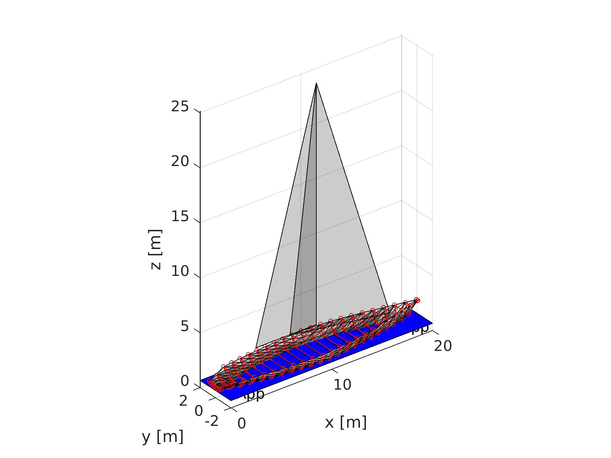

# VPP

matlab implementation of Velocity Prediction Program for sailing yachts.

Project done during my exchange at KTH Royal Institute of Technology in Stockholm.

``` matlab
clc
clear
format compact
%----------------------------------------------------------------  
% Indata
%----------------------------------------------------------------  
  boatname  = 'IMSYC-66';
  designer  = 'Clever Student'; 
  %--------------------------------
  % Input rig parameters
  %--------------------------------    
    rigdata.P   = 22;    % [m] Mainsail hoist
    rigdata.E   = 6;     % [m] Foot of mainsail
    rigdata.J   = 7.3;   % [m] Base of foretriangle
    rigdata.I   = 23.5;  % [m] Height of foretriangle
    rigdata.LPG = 8;     % [m] Perpendicular of longest jib
    rigdata.BAD = 1.5;   % [m] Height of main boom above sheer
  %--------------------------------
  % Input Hull parameters:
  %--------------------------------    
    hulldata.britfair = 'IMSYC66_example.bri'; % The hull geometry file
    hulldata.WK       = 5000;  % [kg]  Bulb weight
    hulldata.LCG      = 10.2;  % [m]   LCB, measured from A.P. 
    hulldata.TK       = 4.5;   % [m]   Keel blade draught from canoe body keel-line
    hulldata.C        = 1.0;   % [m]   Keel average chord
%--------------------------------------------------------------------------      
% Run the Lines Processing Program (LPP)
% to calculate the rest of the parameters on your hull with the correct
% loading using the prepared script LPP_for_VPP.m. The script has
% hulldata & rigdata as arguements and measures the hull in many ways. The
% results are added as fields to hulldata.
  addpath LPP_pcode;
  hulldata = LPP_for_VPP(hulldata,rigdata);
% Input fields in rigdata   : BAD, P, E, I, J
% Input fields in hulldata  : britfair, LCG, TK, WK
% Output fields in hulldata : GZdata, V, LOA, BMAX,KG,LCB,AWP,BWL,
%                             LCF,TC,CM,D,CP,LWL,T,LCBfpp, LCFfpp
% Notes:
%    GZdata contains two columns [HEEL, GZ]
%--------------------------------------------------------------------------
[WTOT,KG,weights] = IMSYC_weight_and_KG(hulldata.LOA,hulldata.TK,hulldata.BMAX,hulldata.WK,rigdata.P,rigdata.E,rigdata.I,rigdata.J,rigdata.BAD,hulldata.D);

%--------------------------------------------------------------------------
% Operating Condtitions
%--------------------------------------------------------------------------

R0      = 1;                     % Reef factor (1=no reef)
TWS     = 5;                     % True Wind Speed[m/s]
TWAd_upwind = 20 : 1 : 120;
TWAd_downwind = 70 : 1 :179;
TWA_upwind = TWAd_upwind * 2 *pi /360;         % true wind angle [rad]
TWA_downwind = TWAd_downwind * 2 *pi /360;

VS0 = TWS/1.5;                 % velocity - initial guess [m/s]
HEEL0 = 1.75*TWS*pi/180;       % heel - initial guess [rad] 

%--------------------------------------------------------------------------
% BEGIN VPP
%--------------------------------------------------------------------------
addpath('../Resistance_hull/');
addpath('../Aero_Sails/');
addpath('../Resistance_fin/');


n_upwind = size (TWA_upwind); 
n_downwind = size (TWA_downwind);
n_upwind(:,1) = []; % allocate memory
n_downwind(:,1) = []; 

VS_upwind(n_upwind) = 0; VS_downwind(n_downwind) = 0;
HEEL_downwind(n_downwind) = 0; HEEL_upwind(n_upwind) = 0;
R_upwind(n_upwind) = 0; R_downwind(n_downwind) = 0;

tic
SAILSET = 1; % [1 or 2] % 1=Upwind, 2=Downwind
[VS_upwind(1),HEEL_upwind(1),iter,FLAG,R_upwind(1)] = solve_Newton(VS0,HEEL0,TWS,TWA_upwind(1),hulldata,rigdata,SAILSET,R0);
for i = 2 : n_upwind
	[VS_upwind(i),HEEL_upwind(i),iter,FLAG,R_upwind(i)] = solve_Newton(VS_upwind(i-1),HEEL_upwind(i-1),TWS,TWA_upwind(i),hulldata,rigdata,SAILSET,R_upwind(i-1));
end

SAILSET = 2; % [1 or 2] % 1=Upwind, 2=Downwind
[VS_downwind(1),HEEL_downwind(1),iter,FLAG,R_downwind(1)] = solve_Newton(VS0,HEEL0,TWS,TWA_downwind(1),hulldata,rigdata,SAILSET,R0);
for i = 2: n_downwind
    [VS_downwind(i),HEEL_downwind(i),iter,FLAG,R_downwind(i)] = solve_Newton(VS_downwind(i-1),HEEL_downwind(i-1),TWS,TWA_downwind(i),hulldata,rigdata,SAILSET,R_downwind(i-1));
end
toc


make_polar_plot(TWS, TWA_upwind,VS_upwind, TWA_downwind,VS_downwind)

```

## Result

![Polar Plot TWS = 5 [m/s]](PolarPlot_TWS=5[ms].jpg)


